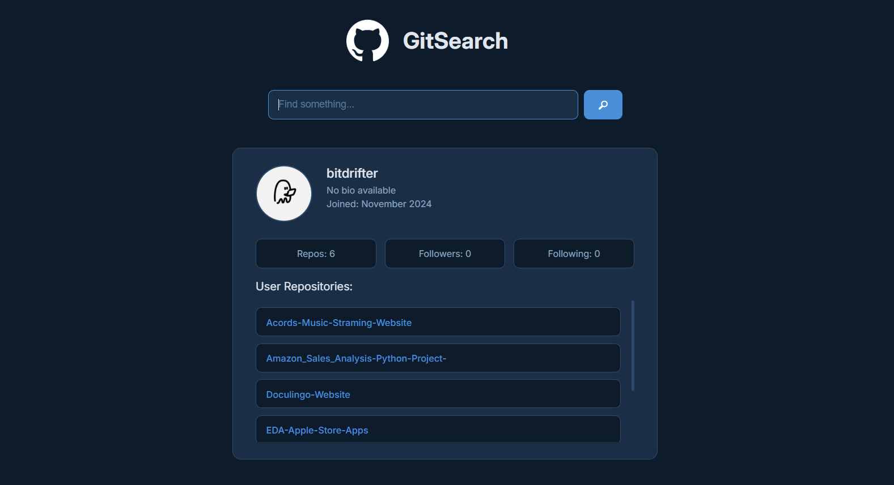

# GitSearch 🔍

Search any GitHub profile and explore their repositories instantly.

## Live Demo
[View App](https://bitdrifter0x.github.io/GitSearch/)

## Features
- Search GitHub users by username
- Displays profile info — avatar, bio, followers, following, join date
- Lists all public repositories with direct links
- Loading and error states for better UX
- Debounced search to minimize API calls

## Built With
HTML · CSS · Vanilla JavaScript · GitHub REST API

## What I Learned
Async/await, fetch API, working with real REST APIs, error handling with try/catch, debouncing, and dynamic DOM rendering from API responses.

## Preview

